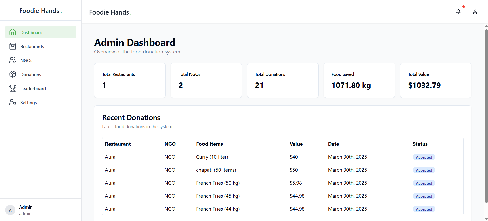
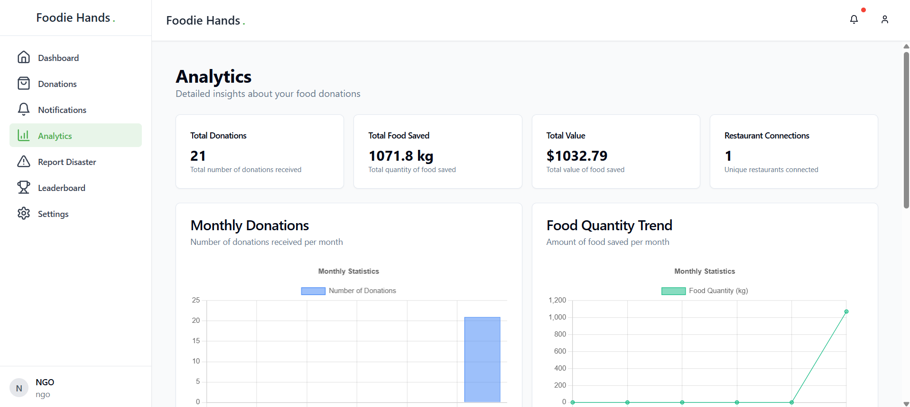
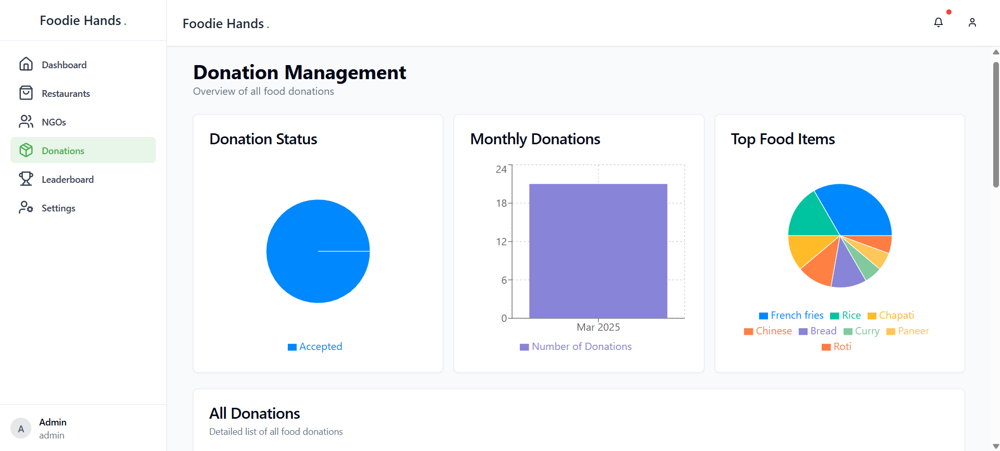
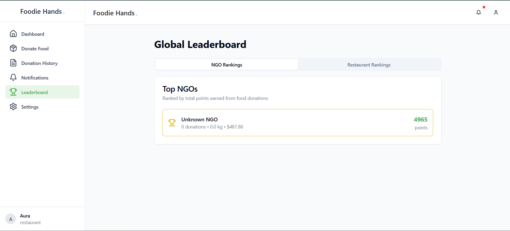
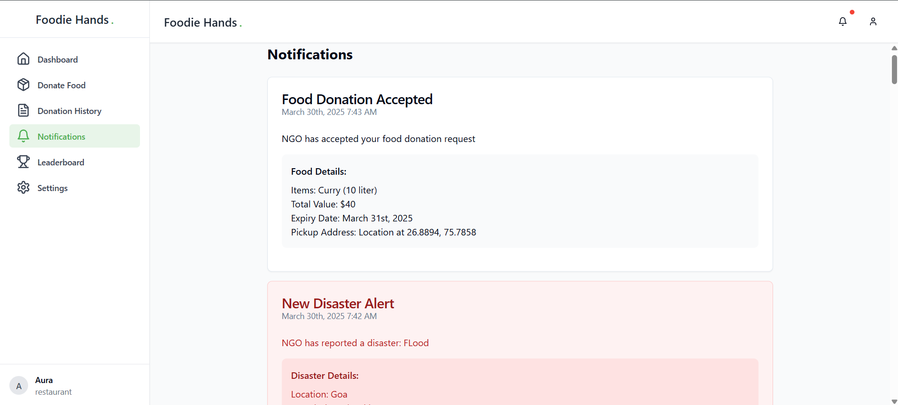

# Foodie Hands 🍽️

A web application that connects restaurants(Individuals also) with NGOs to reduce food waste and help those in need. Restaurants can donate surplus food, and NGOs can collect and distribute it to people who need it.

## Features 🌟

- **Restaurant Features**
  - Donate surplus food
  - Track donation history
  - View notifications
  - Access leaderboard
  - Manage profile settings

- **NGO Features**
  - View available food donations
  - Accept/reject donations
  - Report disasters(So that we can donate food to disaster affected people)
  - Access analytics (Premium)
  - View leaderboard
  - Manage profile settings

- **Admin Features**
  - Manage restaurants and NGOs
  - Monitor donations
  - View platform analytics
  - Manage user roles and permissions

## Screenshots 📸

<div style="display: flex; flex-wrap: wrap; gap: 20px; padding: 20px 0; justify-content: center;">

<div style="flex: 1 1 300px; max-width: 400px; text-align: center;">

<p><i>Restaurant Dashboard</i></p>
</div>

<div style="flex: 1 1 300px; max-width: 400px; text-align: center;">

<p><i>NGO Dashboard</i></p>
</div>

<div style="flex: 1 1 300px; max-width: 400px; text-align: center;">

<p><i>Admin Dashboard</i></p>
</div>

<div style="flex: 1 1 300px; max-width: 400px; text-align: center;">

<p><i>NGO Analytics</i></p>
</div>

<div style="flex: 1 1 300px; max-width: 400px; text-align: center;">

<p><i>Admin Donations Tracking</i></p>
</div>

<div style="flex: 1 1 300px; max-width: 400px; text-align: center;">

<p><i>Global Leaderboard</i></p>
</div>

<div style="flex: 1 1 300px; max-width: 400px; text-align: center;">

<p><i>Real-time Notifications</i></p>
</div>

</div>

## Tech Stack 🛠️

- **Frontend**
  - React with TypeScript
  - Vite
  - Tailwind CSS
  - Shadcn UI Components
  - React Router DOM
  - Firebase Authentication
  - Firebase Firestore
  - Chart.js for analytics

## Prerequisites 📋

- Node.js (v16 or higher)
- npm or yarn
- Firebase account
- Git

## Installation Steps 🚀

1. **Clone the repository**
   ```bash
   git clone https://github.com/faiznakherkar/Foodie-Hands
   cd Foodie-Hands
   ```

2. **Install dependencies**
   ```bash
   npm install
   # or
   yarn install
   ```

3. **Set up Firebase**
   - Create a new Firebase project
   - Enable Authentication with Email/Password
   - Create a Firestore database
   - Get your Firebase configuration

4. **Create environment variables**
   Create a `.env` file in the root directory with the following variables:
   ```env
   VITE_FIREBASE_API_KEY=your_api_key
   VITE_FIREBASE_AUTH_DOMAIN=your_auth_domain
   VITE_FIREBASE_PROJECT_ID=your_project_id
   VITE_FIREBASE_STORAGE_BUCKET=your_storage_bucket
   VITE_FIREBASE_MESSAGING_SENDER_ID=your_messaging_sender_id
   VITE_FIREBASE_APP_ID=your_app_id
   ```

5. **Start the development server**
   ```bash
   npm run dev
   # or
   yarn dev
   ```

6. **Build for production**
   ```bash
   npm run build
   # or
   yarn build
   ```

## Firebase Setup 🔧

1. **Authentication**
   - Enable Email/Password authentication
   - Set up user roles (restaurant, ngo, admin)

2. **Firestore Database**
   - Create the following collections:
     - users
     - donations
     - fooddetails
     - notifications
     - restaurantStats
     - ngoStats
     - disasters

3. **Security Rules**
   - Copy the security rules from `firestore.rules` to your Firebase project

## Project Structure 📁

```
foodie-hands/
├── src/
│   ├── components/
│   │   ├── navigation/
│   │   └── ui/
│   ├── contexts/
│   ├── pages/
│   │   ├── admin/
│   │   ├── ngo/
│   │   └── restaurant/
│   ├── types/
│   ├── lib/
│   ├── firebase.ts
│   └── App.tsx
├── public/
├── .env
├── package.json
└── README.md
```

## Contributing 🤝

1. Fork the repository
2. Create your feature branch (`git checkout -b feature/AmazingFeature`)
3. Commit your changes (`git commit -m 'Add some AmazingFeature'`)
4. Push to the branch (`git push origin feature/AmazingFeature`)
5. Open a Pull Request


## Acknowledgments 🙏

- [Firebase](https://firebase.google.com/)
- [React](https://reactjs.org/)
- [Tailwind CSS](https://tailwindcss.com/)
- [Shadcn UI](https://ui.shadcn.com/)


